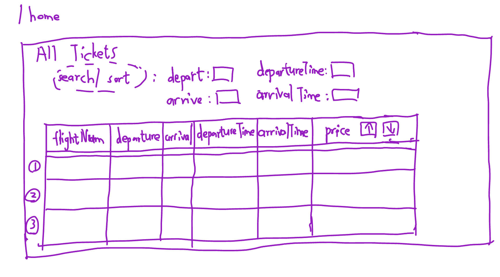
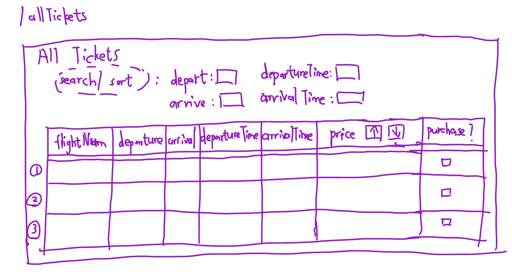
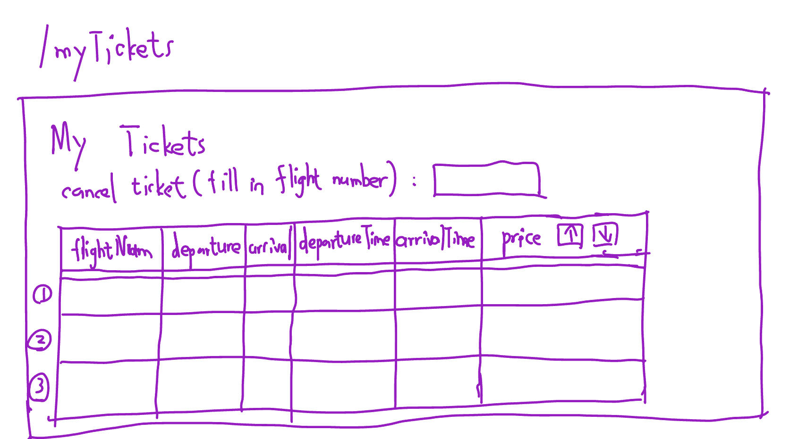
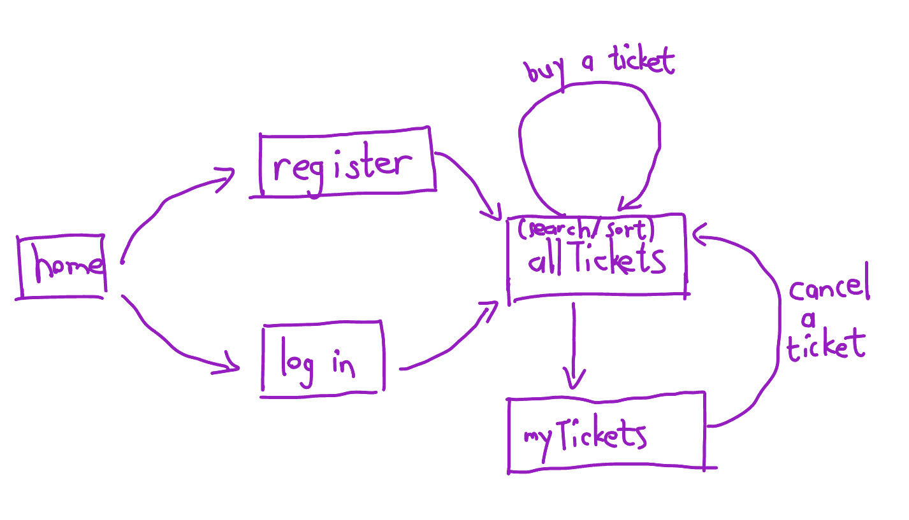

# Airplane Ticket Reservation System

## Overview

Airplane ticket reservation system is a web app of a airline company that will allow users to keep track of the ticket that they have. Users can register and login. Once they're logged in, they can view their ticket that they have bought. Besides, they can view all the air tickets of the certain airline company, search for certain tickets based on some criteria, and they can purchase(add) a ticket to the list of tickets that they have bought accordingly. One ticket corresponds with one flight, and a flight corresponds with multiple tickets. One user can purchase(add) multiple tickets in total, but can only purchase(add) one ticket of a certain flight.

## Data Model

The application will store Users, Lists and Items

* users can have multiple lists (via references)
* each list can have multiple items (by embedding)

The application will store Users and Tickets

* users can have purchased a list of multiple tickets (via references)
* each list of tickets can have multiple tickets(flights) that the user has bought (by embedding)

An Example User:

```javascript
{
  username: "airticketbooker",
  lastname: "Wang",
  hash: // a password hash,
  tickets: // an array of references to Flight documents
}
```

An Example Flight:

```javascript
{
  flightNumber: "AA123",
  departure: "New York",
  arrival: "Los Angeles",
  departureTime: // timestamp,
  arrivalTime: // timestamp,
  price: // number
}
```


## [Link to Commented First Draft Schema](db.mjs) 

## Wireframes

/home(before login) - page for viewing and searching all flights



/allTickets(after login) - page for viewing and searching all flights, and purchasing a flight ticket



/myTickets - page for showing the tickets that the user has bought and canceling a ticket



## Site map

Here's a [complex example from wikipedia](https://upload.wikimedia.org/wikipedia/commons/2/20/Sitemap_google.jpg), but you can create one without the screenshots, drop shadows, etc. ... just names of pages and where they flow to.



## User Stories or Use Cases

1. as non-registered user, I can register a new account with the site
2. as a user, I can log in to the site
3. as a user, I can view all flights available, and search for flights based on some criteria
4. as a user, I can purchase(add) a flight ticket to the list of tickets that I have bought
5. as a user, I can view all the existing flights that I have bought
6. as a user, I can cancel a flight ticket that I have bought

## Research Topics

* (4 points) Passport.js for user authentication
* (2 points) Fetch with post request
    * I'm going to be using `fetch` with a post request to retrieve data from MongoDB
* (1 point) Radio in html
    * I'm going to be using radio in html to allow users to select a flight
* (2 point) Timestamp in js
    * I'm going to be using timestamp in js to record the departure time and arrival time of a flight
* (1 point) Operators(i.e. less than or equal to) that are used to retrieve data from MongoDB


## [Link to Initial Main Project File](app.mjs) 

## Annotations / References Used

1. [passport.js authentication docs](http://passportjs.org/docs) - (add link to source code that was based on this)
2. [tutorial on authentication](https://www.honeybadger.io/blog/javascript-authentication-guide/) - (add link to source code that was based on this)
3. [tutorial on timestamp js](https://stackoverflow.com/questions/221294/how-do-i-get-a-timestamp-in-javascript) - (add link to source code that was based on this)
4. [tutorial on fetch with post request](https://developer.mozilla.org/en-US/docs/Web/API/Fetch_API/Using_Fetch) - (add link to source code that was based on this)
